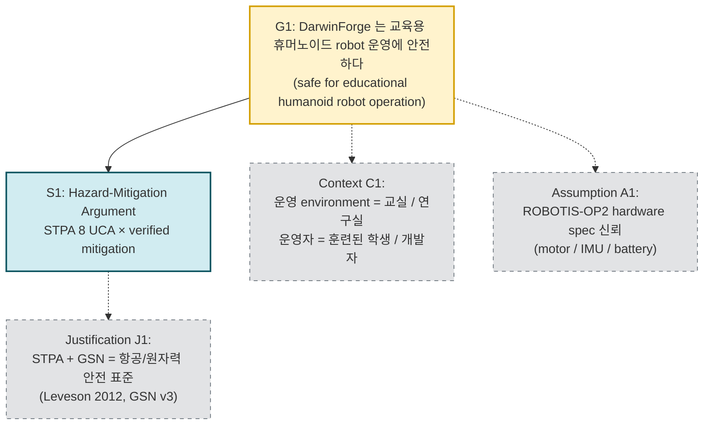
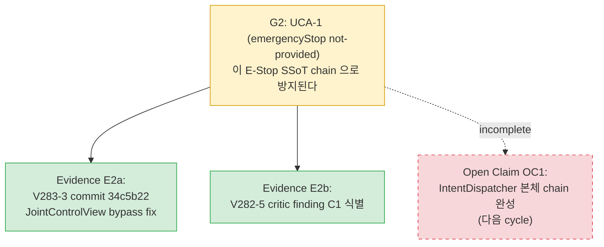
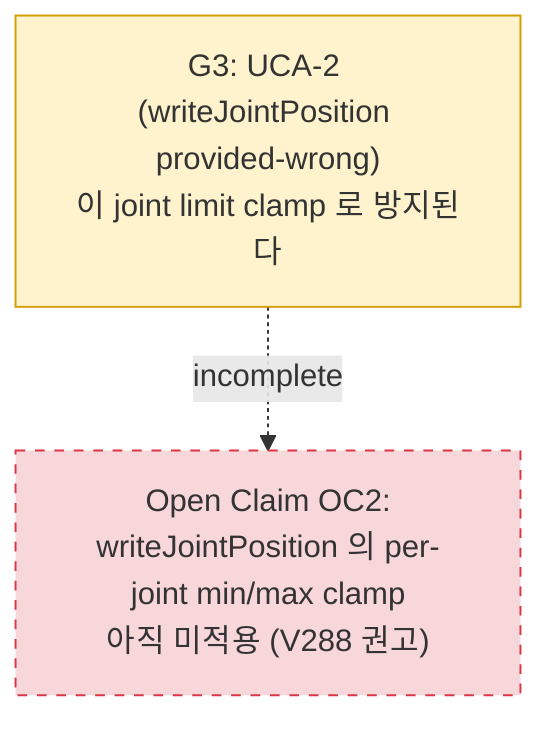
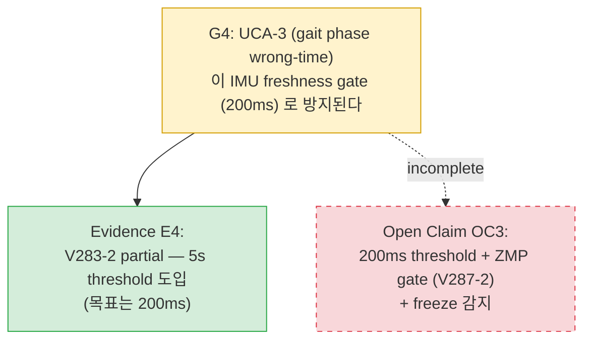
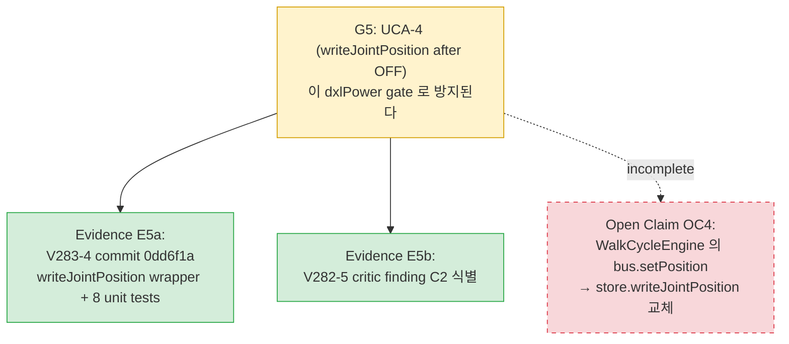
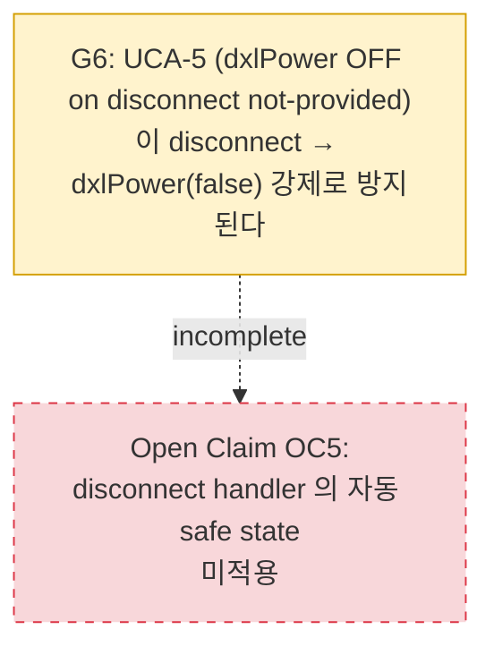
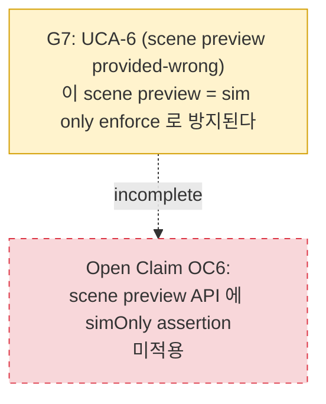
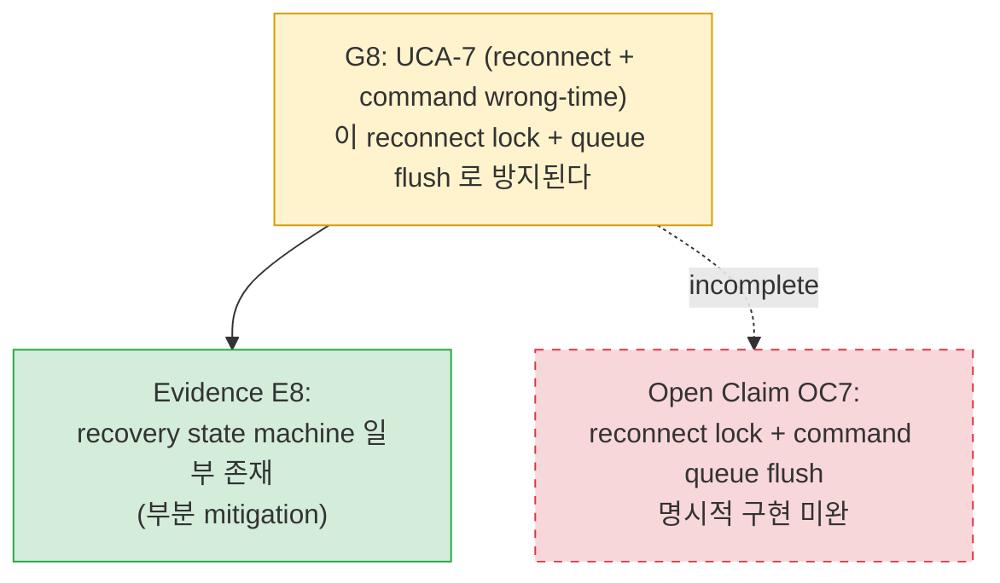
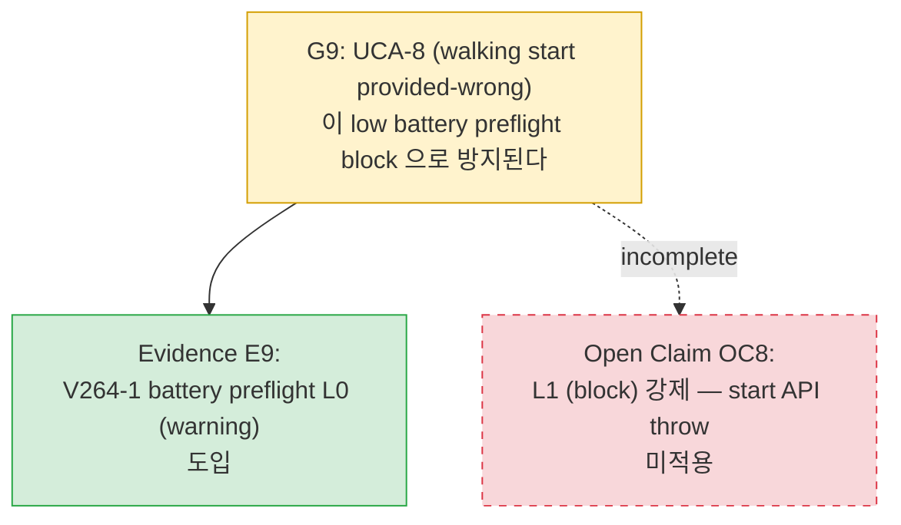

# GSN Safety Case — DarwinForge 2026-05-24

> Goal Structuring Notation (GSN Community Standard v3, 2021).
> 본 문서는 STPA analysis (`stpa-analysis-2026-05-24.md`) 의 8개 UCA 를
> "Hazard-Mitigation Argument" 로 시각화한 V287-4 산출물.

| 항목 | 값 |
|---|---|
| 작성일 | 2026-05-24 (KST) |
| 사이클 | V287-4 |
| 방법론 | GSN Community Standard v3 (2021) |
| 대상 | DarwinForge macOS app + ROBOTIS-OP2 robot |
| 관련 문서 | `stpa-analysis-2026-05-24.md`, V286-1, V282-5 |

---

## 1. Top Goal (G1)

### G1 statement

**"DarwinForge is safe for educational humanoid robot operation, within the bounds defined by ISO 13482 personal-care-robot Class B/C risk levels."**

### Strategy S1

**"Hazard-Mitigation Argument"** — STPA 에서 식별된 8개 UCA 에 대해 각각 mitigation 이 존재하고 evidence 로 검증된다는 논증.

---

## 2. Sub-Goals (G2-G9) — UCA 별

각 UCA 에 대응하는 sub-goal + evidence 노드.

### G2 — UCA-1 prevented by E-Stop SSoT chain

### G3 — UCA-2 prevented by joint limit clamp

### G4 — UCA-3 prevented by IMU freshness gate

### G5 — UCA-4 prevented by dxlPower gate

### G6 — UCA-5 prevented by disconnect-safe-state

### G7 — UCA-6 prevented by scene preview = sim only

### G8 — UCA-7 prevented by reconnect lock + flush

### G9 — UCA-8 prevented by battery preflight block

---

## 3. Evidence Nodes — 통합 인덱스

전체 case 에서 사용된 evidence 노드.

| Evidence ID | 출처 | 종류 | UCA 매핑 |
|---|---|---|---|
| **E-V277A** | V277-A 사이클 평가: **58/100** | overall safety score | G1 |
| **E-V281-5** | V281-5 사이클 평가: **65/100** (+7) | overall safety score | G1 |
| **E-ISO13482** | ISO 13482 self-assessment: **5/10** | external standard | G1 |
| **E-NPR7150** | NPR 7150.2D Class C: **60%** | external standard | G1 |
| **E-V286-1** | V286-1 STPA 8 UCA 식별 보고 | hazard analysis | G2-G9 |
| **E2a** | V283-3 commit `34c5b22` | code + test | G2 |
| **E2b** | V282-5 critic C1 finding | analysis | G2 |
| **E4** | V283-2 partial (5s threshold) | code | G4 |
| **E5a** | V283-4 commit `0dd6f1a` (+8 tests) | code + test | G5 |
| **E5b** | V282-5 critic C2 finding | analysis | G5 |
| **E8** | recovery state machine (V247-x) | code | G8 |
| **E9** | V264-1 battery preflight L0 | code | G9 |

### GSN 노드 카운트 (요약)

| 노드 종류 | 개수 |
|---|---|
| **Goal** (G1 top + G2-G9 sub) | **9** |
| **Strategy** (S1) | **1** |
| **Context / Assumption / Justification** | **3** (C1, A1, J1) |
| **Evidence** (E2a, E2b, E4, E5a, E5b, E8, E9 + 4 overall) | **11** |
| **Open Claim** (OC1-OC8) | **8** |
| 전체 | **32** |

---

## 4. Open Claims — Mitigation 미완 목록

다음 cycle (V287-5+) 에서 처리해야 할 미완 안전 주장 (claims that are still open).

| Open Claim | Goal | 의도 | 차단 사유 | 권고 cycle |
|---|---|---|---|---|
| **OC1** | G2 | IntentDispatcher 본체 e-stop chain 완성 | V282-5 critic 의 C1 본체 fix 누락 | V287-5 (실 fix) |
| **OC2** | G3 | writeJointPosition joint limit clamp | 신규 작업, V288 권고 | V288 |
| **OC3** | G4 | 200ms threshold + ZMP gate + freeze | V283-2 부분 적용, V287-2 의존 | V287-5+ |
| **OC4** | G5 | WalkCycleEngine bus.setPosition → store API 교체 | V282-5 critic 의 C2 본체 fix 누락 | V287-5 (실 fix) |
| **OC5** | G6 | disconnect → dxlPower(false) 강제 | 자동 safe state 부재 | V288 |
| **OC6** | G7 | scene preview = sim only assertion | 신규 작업 | V288 |
| **OC7** | G8 | reconnect lock + queue flush 명시 | 부분 mitigation 만 존재 | V288 |
| **OC8** | G9 | low battery preflight L1 (block) | V264-1 L0 만 적용 | V287-5 |

### 우선순위 분류

- **Critical Path** (V282-5 critic 직접 매핑): OC1, OC4 → V287-5 cycle 에서 즉시 실 fix
- **High Risk** (L1 loss 직결): OC3, OC8 → V287-5 에서 정책 적용
- **Medium Risk** (defense in depth): OC2, OC5, OC6, OC7 → V288 cycle

---

## 5. Confidence Statement

본 safety case 의 신뢰도는 **moderate** 으로 평가:

- **High confidence (3건)**: G2/G5/G9 — evidence (commit + test) 존재.
- **Moderate confidence (1건)**: G4/G8 — partial evidence.
- **Low confidence (4건)**: G3/G6/G7/G8 — open claim only, mitigation 미적용.

> ISO 13482 self-assessment 5/10 + NPR 7150.2D 60% 와 일치 — 안전 case 가 50% 수준에서 시작.
> V287-5 + V288 cycle 에서 OC1-OC8 처리 후 재평가 권고.

---

## 6. 참조

- GSN Community Standard v3 (2021). https://scsc.uk/gsn
- Kelly, T., Weaver, R. "The Goal Structuring Notation — A Safety Argument Notation." DSN 2004.
- Leveson, N. G. *Engineering a Safer World*. MIT Press, 2012.
- ISO 13482:2014 — *Robots and robotic devices — Safety requirements for personal care robots*.
- NPR 7150.2D — *NASA Software Engineering Requirements*.
- `stpa-analysis-2026-05-24.md` (사이클 V287-4 자매 문서).
- V286-1 STPA hazard 8건 식별 보고.
- V282-5 critic 보고: CRITICAL C1, C2.
- V277-A, V281-5 사이클 평가.
