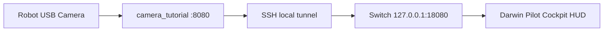

# Switch Robot Camera HUD Feasibility

Date: 2026-06-04

## 결론

Switchroot Ubuntu가 로봇에 SSH 접속할 수 있다면, 로봇 머리 카메라 영상을 Switch Cockpit에 띄우는 것은 기술적으로 가능하다. 가장 현실적인 경로는 로봇의 ROBOTIS `camera_tutorial`을 SSH로 시작하고, Switch에서 SSH 로컬 포트포워딩을 열어 `http://127.0.0.1:18080/?action=stream`을 Cockpit 안의 MJPEG 이미지 레이어로 표시하는 방식이다.

단, 실기기 전까지 확정할 수 없는 항목이 있다.

- 로봇 카메라가 실제로 `/dev/video0`로 잡히는지
- 로봇에서 `camera_tutorial`이 빌드되고 8080 포트를 여는지
- Switchroot 브라우저가 ROBOTIS MJPEG stream을 장시간 안정적으로 렌더링하는지
- 영상 지연이 조종에 허용 가능한 수준인지

## 로컬 증거

현재 로봇 백업과 코드베이스에는 카메라 스트리밍에 필요한 자산이 있다.

- `firmware-backups/sda1-rootfs/lib/modules/3.2.66-op2/kernel/drivers/media/video/uvc/uvcvideo.ko`
- `firmware-backups/sda1-rootfs/lib/modules/3.2.66-op2/kernel/drivers/media/video/videodev.ko`
- `firmware-backups/sda1-rootfs/robotis/Linux/project/tutorial/camera/main.cpp`
- `firmware-backups/sda1-rootfs/robotis/Linux/build/streamer/mjpg_streamer.cpp`
- `app/ui/DarwinForge/Sources/DarwinForgeUI/Pilot/MjpegStreamingClient.swift`
- `app/ui/DarwinForge/Sources/DarwinForgeUI/Connection/RobotSetupCommand.swift`

`camera_tutorial`의 핵심 루프는 다음 구조다.

```cpp
LinuxCamera::GetInstance()->Initialize(0);
LinuxCamera::GetInstance()->CaptureFrame();
streamer->send_image(LinuxCamera::GetInstance()->fbuffer->m_YUVFrame);
```

`mjpg_streamer.cpp`는 8080 포트로 서버를 열고, `httpd.cpp`는 다음 요청을 처리한다.

- `GET /?action=snapshot`
- `GET /?action=stream`

ROBOTIS 공식 e-Manual도 카메라 튜토리얼이 `LinuxCamera`, `mjpg_streamer`, 8080 브라우저 스트리밍 구조임을 설명한다. 또한 `/darwin/Linux/project/tutorial/camera`에서 `make` 후 `./camera_tutorial`을 실행하고 `http://192.168.123.1:8080`으로 접속하는 절차를 제시한다.

Reference: https://emanual.robotis.com/docs/en/platform/op/development/

## 권장 구조

### A. SSH 터널 방식

보안과 네트워크 단순성을 고려하면 이 방식을 1순위로 둔다.



Switch에서 실행:

```bash
ROBOT_HOST=192.168.123.1 ROBOT_USER=robotis darwin-switch-camera-tunnel
```

Cockpit 설정:

```json
"camera": {
  "enabled": true,
  "label": "Darwin Head Camera",
  "route": "ssh-tunnel",
  "stream_url": "http://127.0.0.1:18080/?action=stream",
  "snapshot_url": "http://127.0.0.1:18080/?action=snapshot"
}
```

장점:

- 로봇의 8080 포트를 외부에 직접 노출하지 않아도 된다.
- Switch Cockpit은 항상 localhost URL만 보면 된다.
- SSH 로그인만 검증되면 네트워크 구조가 단순해진다.

한계:

- SSH 세션이 끊기면 영상도 끊긴다.
- 비밀번호 인증이면 매번 입력이 필요하다. Switch용 SSH key 등록이 필요하다.
- `camera_tutorial`이 sudo로 카메라를 열어야 할 수 있다.

### B. 직접 8080 접속 방식

Switch와 로봇이 같은 신뢰 네트워크에 있고 8080 접근이 가능하면 직접 볼 수도 있다.

```text
http://<robot-ip>:8080/?action=stream
```

장점:

- SSH 터널 프로세스가 필요 없다.
- 구조가 가장 단순하다.

한계:

- 로봇 카메라 서버가 네트워크에 그대로 노출된다.
- 네트워크 변경 때마다 IP를 설정해야 한다.
- 방화벽/라우팅 상태에 영향을 받는다.

## Switch HUD 구현 상태

`tools/switch-pilot`에 사전 구현을 추가했다.

- Cockpit 중앙 스테이지에 MJPEG 카메라 레이어 추가
- 카메라 상태 HUD 추가: `CAMERA WAIT`, `CAMERA LIVE`, `CAMERA LOST`, `CAMERA OFF`
- 메카 조종석 느낌의 reticle/scan HUD 추가
- 카메라 실패 시 기존 로봇 피겨/상태 화면 유지
- 기본 카메라 URL을 SSH 터널 기준으로 설정
- `darwin-switch-camera-tunnel` helper 추가
- Firefox가 있으면 kiosk 실행 시 Firefox를 우선 사용하도록 변경

## 실기 테스트 체크리스트

로봇에서:

```bash
ls -la /dev/video*
lsmod | grep -E 'uvcvideo|videodev'
cd /robotis/Linux/project/tutorial/camera
make
sudo ./camera_tutorial
```

Switch에서 직접 확인:

```bash
curl -I http://<robot-ip>:8080/?action=snapshot
```

Switch에서 SSH 터널 확인:

```bash
ROBOT_HOST=<robot-ip> ROBOT_USER=robotis darwin-switch-camera-tunnel
```

다른 터미널에서:

```bash
curl -I http://127.0.0.1:18080/?action=snapshot
```

Cockpit에서:

- `CAMERA WAIT`에서 `CAMERA LIVE`로 바뀌는지
- 영상이 중앙 조종 HUD 뒤에 표시되는지
- 5분 이상 켜도 브라우저 메모리/프레임 끊김이 없는지
- 조종 입력과 영상 렌더링이 서로 지연을 만들지 않는지

## 리스크

`camera_tutorial`은 MJPEG 방식이라 구현이 단순하고 브라우저 호환성이 좋지만, 압축과 전송 비용이 있다. 로봇 CPU가 약하고 Wi-Fi가 약하면 30fps 체감은 어려울 수 있다. 첫 목표는 320x240 또는 기본 ROBOTIS 해상도에서 안정적으로 표시되는지 확인하는 것이다.

ROBOTIS 공식 문서는 구형 Chrome 메모리 누수를 언급한다. Switchroot에서는 Firefox를 우선 권장하고, Chromium을 쓰더라도 장시간 안정성 테스트가 필요하다.

## 판단

가능성은 높다. 로봇 커널/백업/공식 튜토리얼/Mac 앱 모두 같은 방향의 증거를 제공한다. 실패 가능성이 있는 부분은 "개념"이 아니라 실기 환경이다. 특히 `/dev/video0`, `camera_tutorial` 빌드, 8080 stream, Switchroot 브라우저 렌더링 네 가지를 확인하면 바로 판단할 수 있다.
